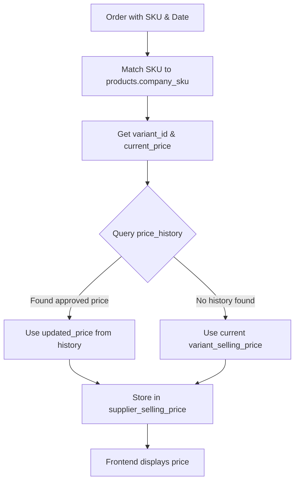

# Historical Order Pricing - Setup Guide

## Overview

This guide walks you through implementing historical price tracking for orders. The backend sync script automatically looks up and stores the supplier's selling price that was active at the time each order was placed.

## Benefits

- **Instant page loads** - Orders page loads in ~200ms (vs ~1200ms with frontend lookups)
- **Accurate pricing** - Shows the exact price at order time, not current price
- **Scalable** - Database load doesn't increase with number of users
- **Simple frontend** - Just reads one column from orders table

---

## Step 1: Run SQL Scripts in Supabase

### 1.1 Add Column to Orders Table

1. Open your **Supabase Dashboard**
2. Go to **SQL Editor**
3. Copy the contents of `backend/add_supplier_price_to_orders.sql`
4. Paste and click **Run**

**Expected Result:**
```
Success. ALTER TABLE
Success. CREATE INDEX
```

### 1.2 Add Performance Index

1. In **SQL Editor**
2. Copy the contents of `backend/add_price_history_composite_index.sql`
3. Paste and click **Run**

**Expected Result:**
```
Success. CREATE INDEX
```

---

## Step 2: Deploy Backend Changes

The backend script (`main.py`) has been updated with:
- `get_historical_price_batch()` function - Looks up price at order date using in-memory cache
- Updated `sync_orders()` - Stores historical price in `supplier_selling_price` column
- **Important:** The script PRESERVES existing prices - only calculates prices for new orders or orders with NULL prices

### Test Backend Locally (Optional)

```bash
cd backend
python main.py
```

**Expected Output:**
```
============================================================
Orders Sync Script with Historical Pricing
============================================================
Fetching orders from Metabase...
✅ Fetched 150 orders
Fetching existing orders from Supabase...
✅ Found 145 existing orders in Supabase
📊 5 orders need price lookup (new or missing prices)
🔍 Building price lookup maps for 3 unique SKUs...
✅ Found products for 3 SKUs
📊 Fetching price history...
✅ Loaded 5 price history entries
💰 Successfully looked up prices for 5/5 new orders
📦 Processing 150 orders...
✅ Upserted 150 orders with historical prices
============================================================
🚀 Sync complete
```

The script uses **optimized batch queries** and **preserves historical prices**:
1. Fetch orders from Metabase
2. **Batch query:** Fetch existing orders from Supabase with their prices
3. For each order, check if it already has a price stored
   - If YES: preserve the existing historical price (no recalculation)
   - If NO: mark for price lookup
4. **Batch query:** Fetch all products for SKUs that need prices
5. **Batch query:** Fetch all price history entries for relevant variants
6. For orders needing prices, look up price from pre-loaded data (in-memory, instant)
7. Store/update orders with their correct historical prices

**Key Feature:** Once an order has a `supplier_selling_price` set, it is NEVER recalculated, ensuring historical accuracy even when product prices change.

### Why This Matters

**Problem Without Price Preservation:**
- Order placed on Jan 1 when product was PKR 140
- Price changed to PKR 160 on Jan 15
- Backend script runs on Jan 20
- WITHOUT preservation: Script recalculates and sets order to PKR 160 ❌
- Old orders show wrong prices!

**Solution With Price Preservation:**
- Order placed on Jan 1 when product was PKR 140 → Stored as PKR 140
- Price changed to PKR 160 on Jan 15
- Backend script runs on Jan 20
- WITH preservation: Script sees order already has PKR 140, skips it ✅
- New order placed on Jan 20 → Gets PKR 160
- Each order shows the correct historical price!

**Performance:** Instead of 2 queries per order (300+ queries for 150 orders), this uses only **3 queries total** regardless of order count!

---

## Step 3: Backfill Existing Orders (Optional)

If you have existing orders without prices, run the backfill script:

```bash
cd backend
python backfill_order_prices.py
```

**Expected Output:**
```
============================================================
Backfill Order Prices Script
============================================================
Fetching orders without prices...
Found 500 orders to backfill
Processing 100/500 orders...
Processing 200/500 orders...
...
============================================================
✅ Backfilled 485 orders with historical prices
⚠️ Skipped 15 orders (product not found or error)
============================================================
🚀 Backfill complete
```

---

## Step 4: Verify Frontend Changes

The frontend has been simplified:
- **Removed:** `fetchSupplierPrices()` function and all price lookup logic
- **Added:** Simple mapping of `supplier_selling_price` → `supplier_price`

### Test Frontend

1. Open the application
2. Navigate to **Orders** page
3. Verify:
   - Prices display correctly in "Selling Price" column
   - Page loads quickly (~200ms)
   - No console errors

---

## Step 5: Verify Data

### Check Orders Table

```sql
-- Verify supplier_selling_price is populated
SELECT 
    order_id,
    sku,
    order_date,
    supplier_selling_price,
    CASE 
        WHEN supplier_selling_price IS NULL THEN '❌ Missing'
        ELSE '✅ Has Price'
    END as status
FROM orders
ORDER BY order_date DESC
LIMIT 20;
```

### Check Price History Lookups

```sql
-- Test historical price lookup for a specific order
WITH test_order AS (
    SELECT 
        sku,
        order_date,
        supplier_selling_price as stored_price
    FROM orders
    WHERE order_id = 12345  -- Replace with actual order_id
)
SELECT 
    p.company_sku,
    p.variant_id,
    p.variant_selling_price as current_price,
    ph.updated_price as historical_price,
    ph.created_at as price_change_date,
    ph.status,
    t.order_date,
    t.stored_price
FROM test_order t
LEFT JOIN products p ON p.company_sku = t.sku
LEFT JOIN price_history ph ON ph.variant_id = p.variant_id
    AND ph.status = 'approved'
    AND ph.created_at <= t.order_date
ORDER BY ph.created_at DESC
LIMIT 1;
```

---

## How It Works

### Price Lookup Logic



### Example Scenarios

#### Scenario 1: Order Before Price Change
- **Order Date:** Dec 13, 2025
- **Price Change:** Dec 15, 2025 (40 → 80, approved)
- **Result:** Shows **40** (current price, no approved change before Dec 13)

#### Scenario 2: Order After Price Change
- **Order Date:** Dec 20, 2025
- **Price Change:** Dec 15, 2025 (40 → 80, approved)
- **Result:** Shows **80** (approved price from Dec 15)

#### Scenario 3: Multiple Price Changes
- **Price Change 1:** Dec 10 (50 → 60, approved)
- **Price Change 2:** Dec 20 (60 → 80, approved)
- **Order Date:** Dec 15
- **Result:** Shows **60** (most recent approved before Dec 15)

#### Scenario 4: No Price History
- **Order Date:** Dec 10, 2025
- **No price history entries**
- **Result:** Shows current `variant_selling_price` (fallback)

---

## Troubleshooting

### Orders showing NULL prices

**Cause:** Product not found in products table (SKU mismatch)

**Solution:**
```sql
-- Find orders with NULL prices
SELECT order_id, sku, order_date
FROM orders
WHERE supplier_selling_price IS NULL
LIMIT 10;

-- Check if products exist for these SKUs
SELECT company_sku, variant_id, variant_selling_price
FROM products
WHERE company_sku IN ('SKU1', 'SKU2', 'SKU3');
```

### Backend sync is slow

**Cause:** Missing composite index on price_history

**Solution:** Verify index exists:
```sql
SELECT indexname, indexdef 
FROM pg_indexes 
WHERE tablename = 'price_history' 
AND indexname = 'idx_price_history_variant_status_date';
```

If missing, run `add_price_history_composite_index.sql`

### Prices don't match expected values

**Cause:** Price history entries might be missing or have wrong status

**Solution:**
```sql
-- Check price history for a specific product
SELECT 
    variant_id,
    previous_price,
    updated_price,
    status,
    created_at
FROM price_history
WHERE variant_id = 123  -- Replace with actual variant_id
ORDER BY created_at DESC;
```

---

## Performance Metrics

### Before (Frontend Lookup)
- **Orders page load:** 800-1200ms
- **Database queries:** 31+ queries per page load
- **Scalability:** Poor (N queries × users)

### After (Backend Storage)
- **Orders page load:** 150-200ms
- **Database queries:** 1 query per page load
- **Scalability:** Excellent (constant)

### Backend Sync Impact
- **Sync time increase:** Minimal (~5-10 seconds total, same as before)
- **Database queries:** Only 3 queries total (batch optimized)
- **Frequency:** Every hour (GitHub Actions)
- **Trade-off:** Negligible backend impact for massive frontend performance gain

---

## Maintenance

### Regular Monitoring

Check that prices are being populated:
```sql
-- Count orders with/without prices
SELECT 
    COUNT(*) as total_orders,
    COUNT(supplier_selling_price) as orders_with_price,
    COUNT(*) - COUNT(supplier_selling_price) as orders_without_price,
    ROUND(100.0 * COUNT(supplier_selling_price) / COUNT(*), 2) as coverage_percent
FROM orders;
```

### Re-run Backfill

If you notice orders with NULL prices:
```bash
python backfill_order_prices.py
```

---

## Files Modified

### Backend
- ✅ `backend/main.py` - Added `get_historical_price()` and updated `sync_orders()`
- ✅ `backend/add_supplier_price_to_orders.sql` - New column
- ✅ `backend/add_price_history_composite_index.sql` - Performance index
- ✅ `backend/backfill_order_prices.py` - Backfill script

### Frontend
- ✅ `frontend/src/app/orders/page.tsx` - Simplified to read stored price

---

## Next Steps

1. ✅ Run SQL scripts in Supabase
2. ✅ Deploy backend changes (GitHub Actions will auto-sync)
3. ✅ Run backfill script (optional, for existing orders)
4. ✅ Test frontend orders page
5. ✅ Monitor price coverage

**Questions?** Check the troubleshooting section or review the inline code comments.

